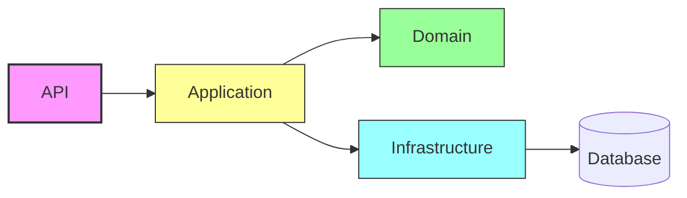

# FieldDevice Monitoring API

**Overview**

FieldDevice Monitoring API is a sample Clean Architecture-based .NET Web API for managing field devices, incidents, and telemetry. It demonstrates:

- Clean Architecture separation of concerns
- Dependency Injection with native .NET DI
- Global error handling via middleware
- EF Core for data persistence
- Unit test project skeleton

**Architecture**



**Quick Start (using Docker Compose for Postgres)**

1. Copy `.env.example` to `.env` and adjust if needed.
2. Start Postgres:

```bash
docker-compose up -d
```

3. Update connection string (or use env var `CONNECTION_STRING`).
4. Run the API (requires .NET SDK 7+):

```bash
cd src/FieldDevice.Api
dotnet run
```

For a quick run without Postgres, the app falls back to an in-memory DB.

**What the repo contains**

- `src/FieldDevice.Api` - API entrypoint, controllers, DI configuration
- `src/FieldDevice.Application` - Use cases and DTOs (skeleton)
- `src/FieldDevice.Domain` - Entities and repository interfaces (skeleton)
- `src/FieldDevice.Infrastructure` - EF Core DbContext and repositories
- `tests/FieldDevice.Application.Tests` - Unit test skeleton

**Endpoints (examples)**

- `GET /api/devices` - list devices (paginated, filter by status/location)
- `POST /api/devices` - create device
- `GET /api/devices/{id}` - get device
- `PUT /api/devices/{id}` - update device
- `DELETE /api/devices/{id}` - delete device
- `POST /api/devices/{id}/incidents` - create incident for a device
- `POST /api/telemetry` - lightweight status update endpoint

**Boas Práticas Demonstradas**

- Clean Architecture layering
- DI with `IServiceCollection`
- Global exception middleware (see `Program.cs`)
- Unit tests for application logic

If you want, I can:
- Run `dotnet` commands to build and test (if .NET SDK is available).
- Add PostgreSQL EF Core provider and migrations.
- Expand unit tests to cover major use cases.

---

Created by: FieldDevice Monitoring API scaffolder
